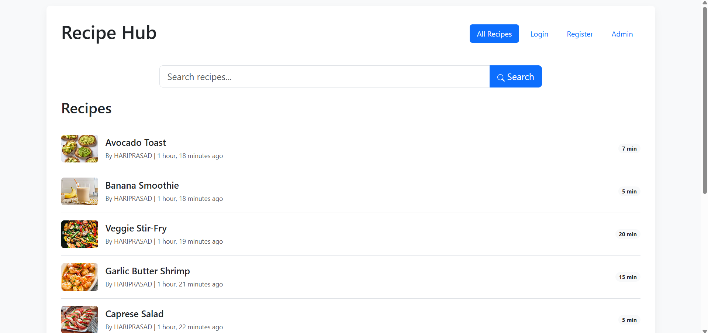
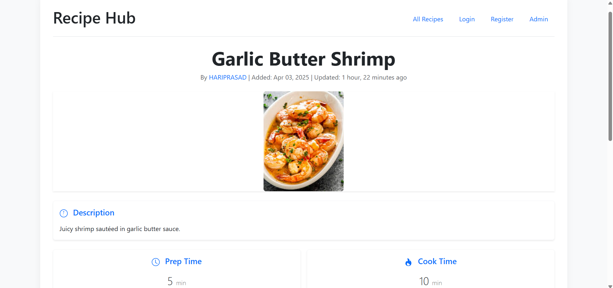
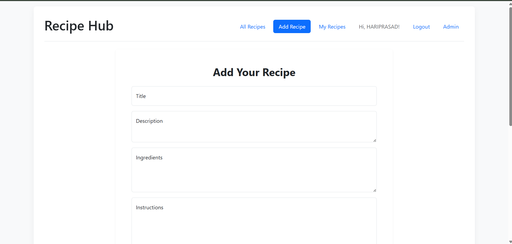
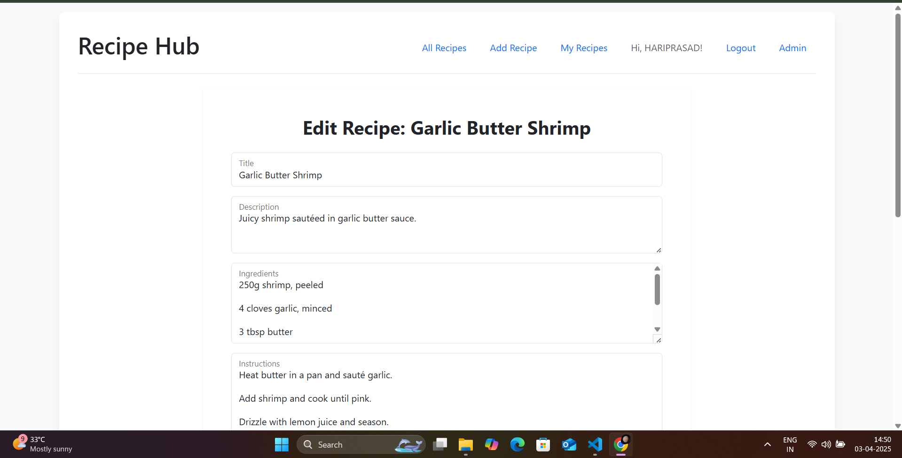
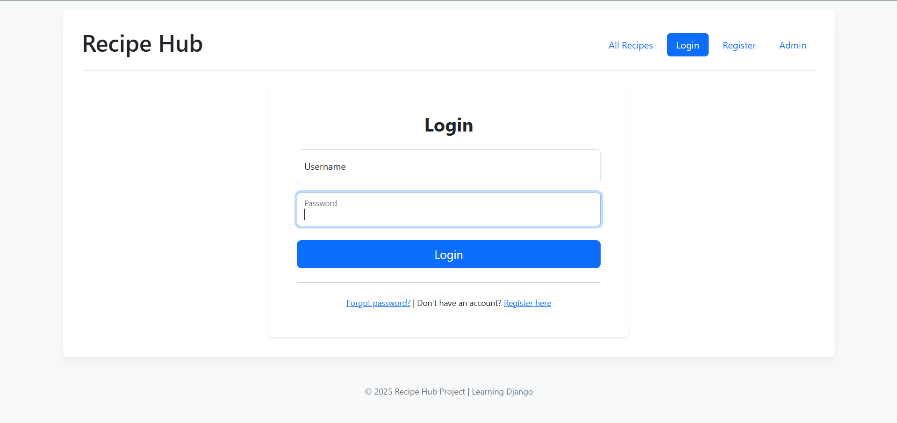
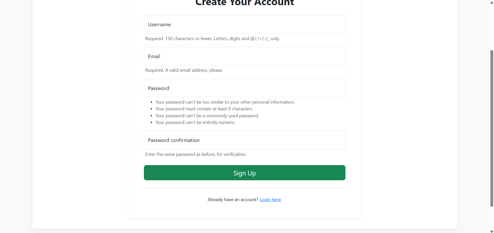

# 🍽️ Recipe Hub

A feature-rich, interactive web application built with Django for browsing, creating, sharing, and managing culinary recipes. This project serves as a practical learning experience for Django development.

<!-- Add a compelling screenshot of your running application here! -->
<!--  -->


---

## 📌 Key Features

- **User Authentication**: Secure user Sign up, Login, and Logout functionality.
- **Recipe Management (CRUD)**: Users can Create, Read (view list & detail), Update, and Delete their own recipes.
- **Authorization**: Strict permissions ensuring users can only modify/delete their own content.
- **Image Uploads**: Ability to add images to recipes, served correctly during development.
- **Recipe Browsing**: View all recipes with pagination.
- **Recipe Search**: Filter recipes by keywords in title, description, ingredients, instructions, or author.
- **"My Recipes" Page**: Logged-in users can view a dedicated list of recipes they created.
- **Responsive UI**: Utilizes Bootstrap for a clean layout adaptable to different screen sizes.
- **Admin Interface**: Leverages Django Admin for easy backend data management (requires superuser).
- **User Feedback**: Displays success and error messages using Django's messages framework.

---

## 🛠️ Tech Stack

- **Backend**: Python (specify version, e.g., 3.11+), Django (specify version, e.g., 5.x)
- **Database**: SQLite (for Development)
- **Frontend**: HTML5, CSS3, Bootstrap 5
- **Image Handling**: Pillow
- **Form Styling**: django-widget-tweaks

---

## 📋 Prerequisites

Before you begin, ensure you have the following installed:

- **Python**: Version 3.8 or higher recommended (check with `python --version` or `python3 --version`).
- **Git**: For cloning the repository (check with `git --version`).
- **pip**: Python package installer (usually comes with Python).

---

## 🚀 Installation & Setup

Follow these steps to get the project running locally:

1. **Clone the Repository**
    ```sh
    git clone https://github.com/HARIPRASADS-01/recipe_hub_project.git
    cd django-recipe-hub
    ```

2. **Create & Activate a Virtual Environment**
    Using a virtual environment is highly recommended to isolate project dependencies.
    ```sh
    # Create the environment (use python3 if python doesn't point to Python 3)
    python -m venv venv

    # Activate the environment:
    # macOS / Linux:
    source venv/bin/activate
    # Windows (Git Bash):
    # source venv/Scripts/activate
    # Windows (Command Prompt / PowerShell):
    # venv\Scripts\activate
    ```
    *(You should see `(venv)` preceding your terminal prompt after activation)*

3. **Install Dependencies**
    This command installs Django and other required packages listed in `requirements.txt`.
    ```sh
    pip install -r requirements.txt
    ```

4. **Apply Database Migrations**
    This creates the necessary database tables based on the project's models.
    ```sh
    python manage.py migrate
    ```

5. **Create a Superuser (for Admin Access)**
    You'll need a superuser account to access the Django admin interface. Follow the prompts to set a username, email (optional), and password.
    ```sh
    python manage.py createsuperuser
    ```

6. **Start the Development Server**
    ```sh
    python manage.py runserver
    ```

7. **Access the Application**
    🔗 Open your web browser and navigate to: **http://127.0.0.1:8000/**
    You should be redirected to the recipe list page.

8. **Access the Admin Interface** (Optional)
    🔗 Navigate to: **http://127.0.0.1:8000/admin/**
    Log in using the superuser credentials you created in step 5.

---

## 📸 Screenshots  

### 🔹 **Recipe List Page**  
  

### 🔹 **Recipe Detail Page**  
  

### 🔹 **Add Recipe Page**  
  

### 🔹 **Edit Recipe Form**  
  

### 🔹 **Login Page**  
  

### 🔹 **Signup Page**  
  

---

## 🧑‍💻 Contributing

Contributions are welcome! If you'd like to improve the Recipe Hub:

1. **Fork** the repository on GitHub.
2. Create a new **branch** for your feature or bug fix (`git checkout -b feature/your-feature-name`).
3. Make your changes and **commit** them (`git commit -m 'Add some feature'`).
4. **Push** your changes to your fork (`git push origin feature/your-feature-name`).
5. Create a **Pull Request** back to the main repository.

Please ensure your code follows standard Python/Django conventions and include tests where appropriate.

---

## 💡 Future Enhancements (Ideas)

- [ ] **Advanced Ingredient Model**: Use ManyToManyField for better structure and search.
- [ ] **Recipe Ratings/Reviews**: Allow users to rate or comment on recipes.
- [ ] **User Profiles**: Dedicated pages for users showing their recipes, etc.
- [ ] **Categorization/Tags**: Organize recipes by category or tags.
- [ ] **Testing**: Add unit and integration tests.
- [ ] **Deployment**: Configure for deployment to a platform like Heroku, PythonAnywhere, or AWS.
- [ ] **API**: Create a REST API for recipes.
